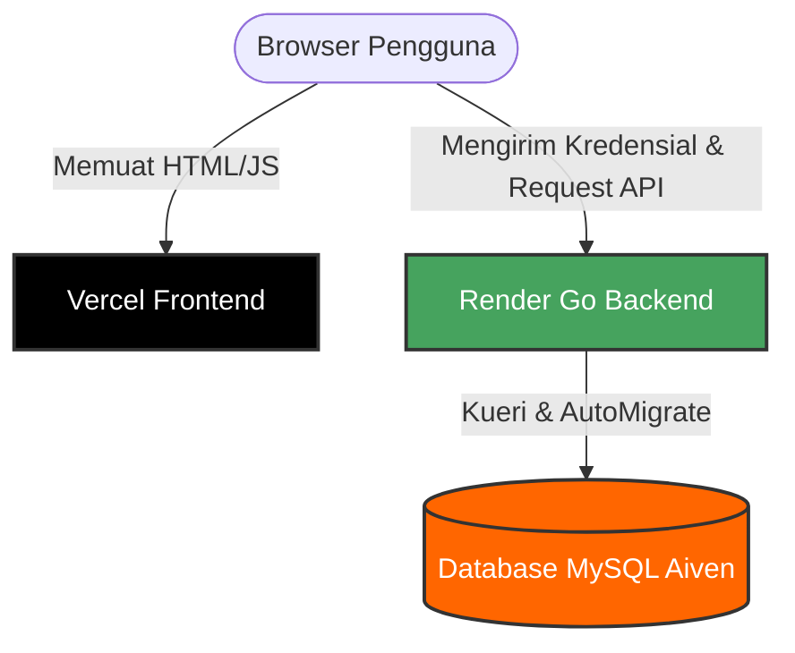

# 🚀 Perjalanan Epik Deployment RecipeScale
> Catatan teknis pemecahan masalah (post-mortem) dan kisah sukses migrasi dari percobaan monorepo Serverless Vercel ke arsitektur Frontend-Backend terpisah yang aman dan stabil.

---

## 🛠️ Cetak Biru Arsitektur (Kondisi Akhir)

Berikut adalah bagaimana alur produksi sistem berjalan dengan lancar saat ini:



---

## 🪵 Kronologi Masalah & Solusi

### 📁 Fase 1: Ilusi Serverless (Error Server Go Persisten di Vercel)
* **Gejala:** Backend macet dan crash saat startup di Vercel dengan log timeout (`User server failed to start...`).
* **Akar Masalah:** Kita mengonfigurasi file `vercel.json` awal untuk menjalankan server Go Fiber yang persisten (`app.Listen`) di dalam infrastruktur Serverless Vercel.
  * Fungsi GORM `AutoMigrate` berjalan saat startup. Karena database berada di Aiven (cloud eksternal), latensi jaringan membuat proses migrasi memakan waktu lebih dari 30 detik.
  * Serverless Function di Vercel memiliki batas waktu startup yang sangat ketat (maksimal 30 detik) dan sifatnya sementara (stateless/ephemeral)—tidak bisa digunakan untuk menjalankan server HTTP persisten yang terus-menerus mendengarkan (*listen*) port.
* **Solusi:** Kita memisahkan hosting.
  * **Frontend** tetap di Vercel sebagai aplikasi statis Single Page Application (SPA) yang super cepat.
  * **Backend** dipindahkan ke **Render**, yang memang dirancang untuk menjalankan binary Go secara persisten (*long-running process*).

---

### 🌐 Fase 2: Konfigurasi Monorepo Terabaikan (Error 404 saat Refresh/Reload Halaman)
* **Gejala:** Ketika langsung membuka URL `/login` atau melakukan refresh/reload di halaman dashboard, Vercel mengembalikan halaman default **404 Page Not Found**.
* **Akar Masalah:**
  1. React/Vite menggunakan *Client-Side Routing* (`BrowserRouter`). Ketika halaman di-refresh, browser mengirim request langsung ke server Vercel untuk mencari file fisik `/login/index.html` yang aslinya memang tidak ada.
  2. Pengaturan **Root Directory** di dashboard Vercel diatur ke `frontend`. Hal ini membuat Vercel sepenuhnya mengabaikan file `vercel.json` yang terletak di luar folder root project.
* **Solusi:**
  * Kita membuat file `/frontend/vercel.json` baru di dalam folder frontend agar terdeteksi oleh Vercel, dengan aturan rewrite SPA:
    ```json
    {
      "rewrites": [
        { "source": "/(.*)", "destination": "/index.html" }
      ]
    }
    ```
    Aturan ini menginstruksikan Vercel untuk mengalihkan seluruh request rute kembali ke `index.html` utama agar ditangani oleh React Router.

---

### 🧪 Fase 3: Environment Variable "Gaib" (Karakteristik Build-time Vite)
* **Gejala:** Meskipun variabel `VITE_API_URL` sudah dimasukkan ke dalam dashboard Vercel, aplikasi frontend masih saja memicu error 404 dan loop request API.
* **Akar Masalah:** Vite membaca dan menyuntikkan environment variable (`import.meta.env`) **hanya pada saat proses build (compile)**. Mengubah nilai di dashboard Vercel tidak akan mengubah file JavaScript yang sudah terlanjur di-deploy. Browser masih mengunduh kode JavaScript lama yang menganggap alamat API-nya kosong (`undefined`).
* **Solusi:** Kita memicu **Redeploy** manual di dashboard Vercel tanpa menggunakan cache. Proses ini membangun ulang kode statis dan sukses menyuntikkan URL backend Render (`https://recipe-scale-api.onrender.com`) ke dalam file JS produksi.

---

### 🍪 Fase 4: Gerbang Cookie (SameSite Lax vs None pada Lintas Domain)
* **Gejala:** Proses registrasi berhasil masuk ke dashboard, namun ketika berpindah halaman atau di-refresh, pengguna langsung terlempar kembali ke halaman login. Konsol browser menunjukkan error `401 Unauthorized` pada endpoint `/api/auth/me`.
* **Akar Masalah:**
  * Backend kita menggunakan pengaman sesi berupa **HttpOnly Cookie** untuk menyimpan token JWT. Properti cookie diatur dengan kebijakan `SameSite: "Lax"`.
  * Karena frontend (`.vercel.app`) dan backend (`.onrender.com`) berada di domain yang berbeda, browser mengklasifikasikan request API ini sebagai request lintas situs (**Cross-Site**).
  * Kebijakan keamanan browser modern (seperti Chrome & Safari) memblokir pengiriman cookie `"Lax"` pada request lintas domain. Akibatnya, token JWT tidak pernah terkirim ke backend dan memicu respons `401`.
* **Solusi:** Kita memperbarui konfigurasi pembuatan cookie di backend Go Fiber (`auth_handler.go`) agar secara dinamis menggunakan kebijakan yang ramah lintas domain saat production:
  ```go
  sameSite := "Lax"
  if os.Getenv("APP_ENV") == "production" {
      sameSite = "None"
  }
  c.Cookie(&fiber.Cookie{
      Name:     "jwt",
      Value:    res.Token,
      Secure:   os.Getenv("APP_ENV") == "production", // Wajib bernilai true jika SameSite=None
      SameSite: sameSite,
  })
  ```

---

## 📈 Pelajaran Penting untuk Skalabilitas Masa Depan
1. **Pemisahan Build:** Selalu pisahkan antara static assets client (Vercel) dengan server proses aplikasi backend (Render/Railway).
2. **Variabel Build-Time:** Pada framework Vite, semua variabel berawalan `VITE_` memerlukan proses build/redeploy baru agar efeknya langsung terasa di client browser.
3. **Kredensial Lintas Domain:** Jika menggunakan cookie untuk sesi auth terpisah domain, properti `SameSite=None` + `Secure` hukumnya wajib, diiringi pengaturan CORS `AllowCredentials: true`.
