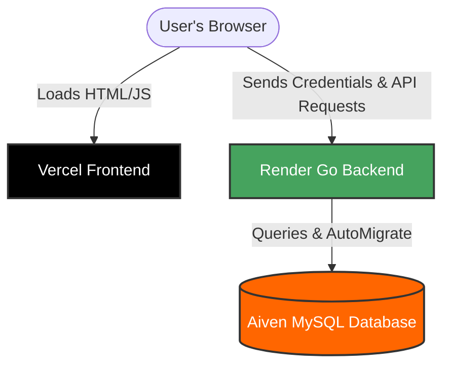

# 🚀 The Epic Deployment Journey of RecipeScale
> A technical post-mortem and success story of shifting from a monolithic Vercel serverless attempt to a robust, secure, and split Frontend-Backend architecture.

---

## 🛠️ The Architecture Blueprint (Final State)

Before diving into the war stories, here is how the working production environment looks today:



---

## 🪵 Chronicles of Solved Catastrophes

### 📁 Phase 1: The Serverless Mirage (Vercel Persistent Server Error)
* **The Symptom:** Backend initialization crashed on Vercel with timeouts (`User server failed to start...`).
* **The Root Cause:** We configured a unified `vercel.json` attempting to run a persistent Go Fiber server (`app.Listen(":" + port)`) inside Vercel. 
  * GORM `AutoMigrate` was running database migrations on startup. Since our database resides in Aiven, executing migrations took around 30+ seconds due to remote latency.
  * Vercel Serverless Functions have a strict start timeout (30 seconds) and are inherently stateless/ephemeral—they cannot run a persistent web socket or listening server.
* **The Fix:** We split the hosting platforms.
  * **Frontend** remained on Vercel as a optimized static Single Page Application (SPA).
  * **Backend** shifted to **Render**, which natively supports persistent long-running Go binary executions.

---

### 🌐 Phase 2: The Monorepo Ignored Configuration (404 Routing on Refresh)
* **The Symptom:** Navigating directly to `/login` or reloading the dashboard returned Vercel's default **404 Page Not Found**.
* **The Root Cause:** 
  1. Vite/React Router utilizes `BrowserRouter` (Client-Side routing). Refreshing the page forces Vercel to lookup physical directories like `/login/index.html` on the server instead of delegating to React's bundle.
  2. The Vercel project's **Root Directory** was configured directly to `/frontend`. This caused Vercel to completely ignore the `vercel.json` we placed in the root of the repository.
* **The Fix:** 
  * We created a localized `/frontend/vercel.json` that configures SPA fallback rewrites:
    ```json
    {
      "rewrites": [
        { "source": "/(.*)", "destination": "/index.html" }
      ]
    }
    ```
    This instructs Vercel to route all sub-paths back to the main `index.html` bundle.

---

### 🧪 Phase 3: The Ghost Environment Variables (Vite Build-time Behavior)
* **The Symptom:** Even after registering the `VITE_API_URL` variable in Vercel settings, the app still threw 404s and API request loops.
* **The Root Cause:** Vite injects environment variables (`import.meta.env`) **strictly at build time**. Simply editing variables in the Vercel dashboard does not dynamically update live client-side bundles. The browser was still serving older JavaScript bundles referencing `undefined` API URLs.
* **The Fix:** We triggered a clean **Redeploy** on Vercel without build cache. This baked the Render URL (`https://recipe-scale-api.onrender.com`) directly into the production JavaScript build.

---

### 🍪 Phase 4: The Cookie Gate (SameSite Lax vs. None in Cross-Domain Routing)
* **The Symptom:** Registering a user worked, but reloading or navigating the dashboard instantly kicked the user back to the login page. Console showed `/api/auth/me` returning `401 Unauthorized`.
* **The Root Cause:** 
  * The backend set session tokens using an `HttpOnly` cookie with `SameSite: "Lax"`.
  * Because our frontend (`.vercel.app`) and backend (`.onrender.com`) are hosted on entirely different domains, the browser flagged the API calls as **Cross-Site**.
  * Chrome/Safari security policies block `"Lax"` cookies on cross-site requests, meaning the token was never sent to Render.
* **The Fix:** We updated the backend cookie injector in Go Fiber (`auth_handler.go`) to automatically switch policies in production:
  ```go
  sameSite := "Lax"
  if os.Getenv("APP_ENV") == "production" {
      sameSite = "None"
  }
  c.Cookie(&fiber.Cookie{
      Name:     "jwt",
      Value:    res.Token,
      Secure:   os.Getenv("APP_ENV") == "production", // Must be true if SameSite=None
      SameSite: sameSite,
  })
  ```

---

## 📈 Key Takeaways for Future Scaling
1. **Build Separation:** Keep static client code (Vercel) decoupled from application processes (Render/Railway).
2. **Compile-time Secrets:** In Vite, any variable prefixed with `VITE_` requires a full rebuild/redeploy to take effect.
3. **Cross-Origin Credentialing:** When using cookies with separated domain configurations, `SameSite=None` + `Secure` is mandatory, alongside CORS `AllowCredentials: true`.
