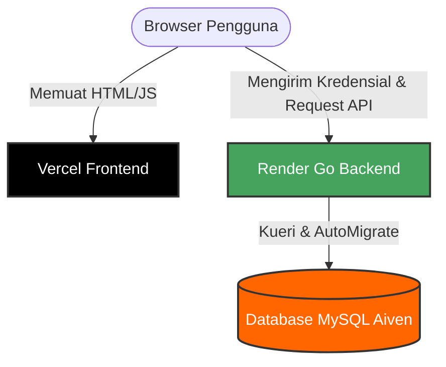

# 🍳 RecipeScale — SaaS Multi-Tenant Costing & Scale Simulator for F&B

<div align="center">


</div>

---

**RecipeScale** adalah platform SaaS *multi-tenant* kalkulator HPP (*Harga Pokok Penjualan*) bertingkat dan simulator porsi saji produksi dapur yang dirancang khusus untuk UMKM F&B, bakery, katering, dan bisnis kuliner. 

Aplikasi ini memecahkan tiga masalah operasional utama F&B secara otomatis:
1. **Berapa HPP aktual** satu porsi makanan/minuman hari ini setelah dihitung dengan modal bahan baku?
2. Jika ada pesanan besar (misal 150 porsi katering), **berapa takaran bahan & bumbu dapur** yang harus ditimbang secara presisi?
3. Jika harga bahan baku di pasar berfluktuasi, **menu mana saja yang margin profitnya terancam** di bawah target food cost?

---

## 🎨 Tampilan Arsitektur Sistem

RecipeScale menggunakan arsitektur terpisah (*split-deployment*) untuk menjamin performa maksimal, keamanan data *multi-tenant*, dan skalabilitas tinggi:



---

## 🚀 Fitur Utama & Keunggulan Rekayasa

### 1. ⚙️ Kalkulator HPP Bertingkat & Validasi Anti-Loop
* **Nested Recipe Support**: Mendukung integrasi bumbu dasar setengah jadi (saus, kaldu, bumbu halus) ke dalam formula menu masakan utama tanpa batas tingkat.
* **XOR Component Validation**: Validasi cerdas yang mencegah bahan baku ganda atau *circular dependencies* (resep yang saling merujuk satu sama lain secara melingkar) di level backend.
* **Workspace Isolation (Multi-Tenant)**: Proteksi data super ketat di mana setiap transaksi, bahan baku, dan resep diisolasi berdasarkan `workspace_id` pengguna yang login.

### 2. 📊 Optimasi UI Menggunakan TanStack Table v8
* Seluruh tabel data utama (Bahan Baku, Resep, Ketersediaan Stok, dan Ledger Analisis Menu) telah dimigrasikan menggunakan `@tanstack/react-table` v8.
* **Keuntungan**:
  * Pengurutan data (*sorting*) multi-kolom yang sangat cepat dan interaktif secara langsung di client browser.
  * Fitur pencarian global instan dan sistem paginasi headless yang menjaga kestabilan tata letak tema gelap (dark mode) premium.
  * Otomatis melakukan reset halaman kembali ke halaman pertama saat melakukan filter pencarian (`autoResetPageIndex: true`).

### 3. ⚖️ Simulator Markup, PB1, & Timbangan Dapur Instan
* **Markup Calculator**: Hitung harga rekomendasi jual berdasarkan target Food Cost %, lengkap dengan simulasi pajak PB1 (10%), Service Charge (5%), profit bersih, dan persentase gross margin.
* **Visual Donut Cost Chart**: Diagram lingkaran interaktif (menggunakan Recharts) yang memetakan persentase kontribusi biaya komponen resep langsung di panel detail.
* **Kitchen Scaling Sheet**: Masukkan porsi saji target yang ingin diproduksi, dan sistem akan langsung menghasilkan *Daftar Timbangan Dapur* baru secara instan secara real-time.

### 🍪 4. Keamanan Auth Berbasis Sesi Lintas Domain
* Menggunakan JWT Token yang disimpan dalam **HttpOnly Cookie** yang dilindungi properti `Secure` dan `SameSite: None` di lingkungan production.
* Menjamin keamanan token dari serangan XSS (*Cross-Site Scripting*) sekaligus memungkinkan komunikasi kredensial yang lancar antara Vercel frontend dan Render backend.

---

## 📁 Struktur Folder Proyek

```text
recipe-scale/
├── backend/
│   ├── cmd/api/main.go          # Entrypoint server Go Fiber
│   ├── internal/
│   │   ├── config/              # Konfigurasi database, TLS Aiven, & AutoMigrate
│   │   ├── domain/              # Struktur data GORM model
│   │   ├── handler/             # REST API Handlers & Routing (auth, custom unit, dll)
│   │   ├── middleware/          # JWT Auth Session Guard
│   │   └── service/             # Logika Bisnis Utama (HPP, kalkulasi, normalisasi unit)
│   └── go.mod
├── frontend/
│   ├── src/
│   │   ├── components/          # Reusable UI & Layout Components (DashboardLayout)
│   │   ├── lib/                 # Konfigurasi Axios API Client & Interceptors
│   │   ├── pages/               # Halaman Dashboard, Bahan Baku, Resep, Stok, & Analisis
│   │   ├── types/               # TypeScript Definitions
│   │   └── App.tsx              # Routing dan Guard autentikasi
│   ├── vercel.json              # Konfigurasi routing rewrite SPA Vercel
│   └── package.json
└── render.yaml                  # Konfigurasi deklaratif deploy backend Render
```

---

## 🏁 Panduan Memulai (Lokal)

### 1. Prasyarat
* Pasang **Go 1.21 atau lebih tinggi**
* Pasang **Node.js 18 atau lebih tinggi**
* Server **MySQL** aktif (Port default `3306`)

### 2. Konfigurasi Backend
1. Masuk ke direktori backend:
   ```bash
   cd backend
   ```
2. Buat berkas `.env` dan masukkan konfigurasi berikut:
   ```env
   DB_DSN="user:password@tcp(127.0.0.1:3306)/recipescale?charset=utf8mb4&parseTime=True&loc=Local"
   JWT_SECRET="masukkan_kunci_jwt_secret_acak_yang_aman_di_sini"
   PORT="8085"
   FRONTEND_URL="http://localhost:5173"
   APP_ENV="development"
   ```
3. Unduh modul dan jalankan server API:
   ```bash
   go run cmd/api/main.go
   ```

### 3. Konfigurasi Frontend
1. Masuk ke direktori frontend:
   ```bash
   cd frontend
   ```
2. Pasang semua dependensi npm:
   ```bash
   npm install
   ```
3. Jalankan server pengembangan Vite:
   ```bash
   npm run dev
   ```
4. Buka peramban di alamat `http://localhost:5173`.

---

## 🚀 Panduan Deployment (Produksi)

Proyek ini dideploy menggunakan arsitektur terpisah untuk efisiensi biaya dan performa:

### 1. Frontend (Vercel)
*   Dihosting sebagai aplikasi statis Single Page Application (SPA).
*   **Penting**: Memerlukan berkas `vercel.json` di dalam folder `frontend/` untuk mengarahkan ulang semua rute klien ke `index.html` agar rute seperti `/login` tidak memicu error 404 ketika di-refresh.
*   Environment Variable wajib:
    *   `VITE_API_URL`: Diarahkan ke alamat HTTPS dari Backend Render.

### 2. Backend (Render)
*   Dihosting sebagai Web Service persisten dengan lingkungan (environment) **Go**.
*   Root directory diatur ke folder `backend/`.
*   Perintah Build: `cd backend && go build -o main ./cmd/api/main.go`
*   Perintah Start: `cd backend && ./main`
*   Environment Variables wajib:
    *   `APP_ENV`: `production`
    *   `DB_DSN`: String koneksi database MySQL Aiven (mendukung TLS).
    *   `JWT_SECRET`: Kunci rahasia pengaman token.
    *   `FRONTEND_URL`: URL frontend Vercel (untuk konfigurasi CORS).
    *   `PORT`: `10000` (Port default Render Web Service).
